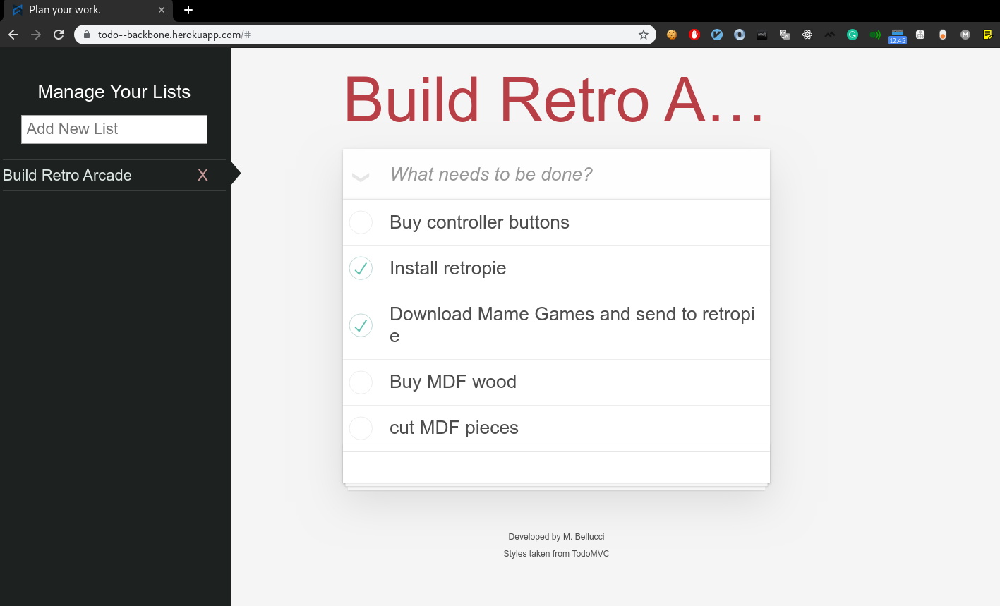

# Todo app

Achieve your goals by planning with todo's lists.  
Single page application with frontend and backend implementation which allows creation of tasks and lists of tasks, along with destroying and mark them as completed.  

# Demo

Visit [https://todo--backbone.herokuapp.com/](https://todo--backbone.herokuapp.com/) to see it working.


## Pre-requisites
* Node >= 8.16.1
* Ruby >= 2.5.7

## Build backend

```bash
cd backend
bundle install
bundle exec rake db:create
bundle exec rake db:migrate
bundle exec rake db:seed
rails server
```

## Build frontend

```bash
cd frontend
npm install
npm run build
npm run dev
```

Visit http://localhost:8080

# Functionality
An anonymous user can create account.  
User can login and manage their tasks into lists and items.  
Those tasks can be marked as completed and can be deleted.  

## Used technologies
### Frontend
* Webpack
* Backbone
* Underscore
* Jquery

### Backend
* Rails 6 api
* JWT authentication
* Rspec

#### Architecture
Follows a UseCase oriented architecture see [wiki:architecture](https://github.com/delbetu/todo-app/wiki/Architecture)

#### Why this architecture is awesome?
* Core implementation allows the separation of functionality and framework(low level details)
>> * Functionality is coded in only one place which makes it easier to mantain ( is not spreaded over random parts of code )
>> * Controllers communicate with Core just by sending/receiveing data transfer objects ( this implements `the separation` )
>> * It would be easy to change from Rails to Sinatra+Data-Mapper
>> * It allows outside-in TDD
* Core is easier to change
>> * Core tests run fast! they do not deppend on rails
>> * Core contracts are clearly specified
>> * When developing core your mind is focused on functionality, so you can think more on possible test cases making your code more robust
* Configurable code
>> * Authentication use a simple role based strategy which is easy to extend new roles by perms configuration

## API
Every request must use content type application/json
Endpoints under /group_items/** need authentication so you need to attach `Authorization` header with provided token.

## Endpoints (Curl examples)
| Description             | Rails-Endpoint                                         | Backbone call                 |
|-------------------------|--------------------------------------------------------|-------------------------------|
| Get auth token          | POST   /api/v1/auth_token                              |auth-model.login()             |
| Fetch items for a group | GET    /api/v1/group_items/:group_item_id/items        |group-item-collection.fetch(); |
| Create item for a group | POST   /api/v1/group_items/:group_item_id/items        |group-item-collection.create();|
| Get item for a group    | GET    /api/v1/group_items/:group_item_id/items/:id    |item-model.fetch();            |
| Update item for a group | PUT    /api/v1/group_items/:group_item_id/items/:id    |item-model.save();             |
| Delete item             | DELETE /api/v1/group_items/:group_item_id/items/:id    |item-model.destroy();          |
| Get group item          | GET    /api/v1/group_items                             |item-collection.fetch();       |
| Create group item       | POST    /api/v1/group_items/                           |item-collection.create()       |
| Update group item       | PUT    /api/v1/group_items/:id                         |group-item-model.save();       |
| Delete group item       | DELETE /api/v1/group_items/:id                         |group-item-model.destroy();    |

#### Authorization
Get token for existing user from email and password.

```
curl -i -X POST \
     -H "Content-Type:application/x-www-form-urlencoded" \
     -d "credentials[email]=admin@todo.com" \
     -d "credentials[password]=admin" \
     'http://localhost:3000/api/v1/auth_token'
```

#### GroupItem
Attributes list_title, list_items

```
curl -i -X GET \
 'http://localhost:3000/api/v1/group_items'

curl -i -X GET \
 'http://localhost:3000/api/v1/group_items/1'

curl -i -X POST \
   -H "Content-Type:application/json" \
   -d '{ "list_title" : "Job tasks" }' \
   'http://localhost:3000/api/v1/group_items'

curl -i -X PUT \
   -H "Content-Type:application/json" \
   -d '{ "list_title" : "Job Tasks"  }' \
   'http://localhost:3000/api/v1/group_items/1'

curl -i -X DELETE \
   -H "Content-Type:application/json" \
   'http://localhost:3000/api/v1/group_items/1'
```

#### Items
Attributes title, completed

```
curl -i -X GET \
 'http://localhost:3000/api/v1/group_items/3/items'

curl -i -X GET \
 'http://localhost:3000/api/v1/group_items/3/items/6'

curl -i -X POST \
   -H "Content-Type:application/json" \
   -d '{ "title": "Write integration tests"  }' \
   'http://localhost:3000/api/v1/group_items/3/items'

PUT    /group_item/:group_id/:id

curl -i -X PUT \
   -H "Content-Type:application/json" \
   -d '{ "title": "Write unit tests"  }' \
   'http://localhost:3000/api/v1/group_items/3/items'

curl -i -X DELETE \
   -H "Content-Type:application/json" \
   'http://localhost:3000/api/v1/group_items/3/items/6'
```

## Pending tasks

* Allow filtering completed/pending tasks
* Double click over each item to edit its text
* Add `notes` to each item
* Add google Signup/Signin
* Create a chrome extension client

## Possible future features
* Share with other users
* Assign tasks to other people
